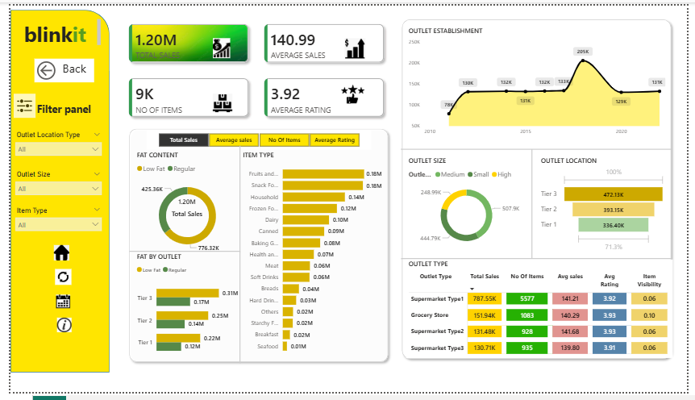

# Blinkit Sales Dashboard (Power BI)

## Project Overview
This Power BI dashboard analyzes Blinkit sales data to evaluate business performance, track KPIs, and identify category-level insights.

## KPIs Used
- Total Sales
- Total Orders
- Average Order Value
- Category-wise Revenue
- City-wise Performance

## Tools & Technologies
- Power BI
- DAX
- Data Cleaning
- Data Modeling

## Dashboard Preview

### Overview

## Key Insights
- Identified top-performing product categories
- Analyzed revenue distribution across cities
- Tracked overall business growth using KPI cards
